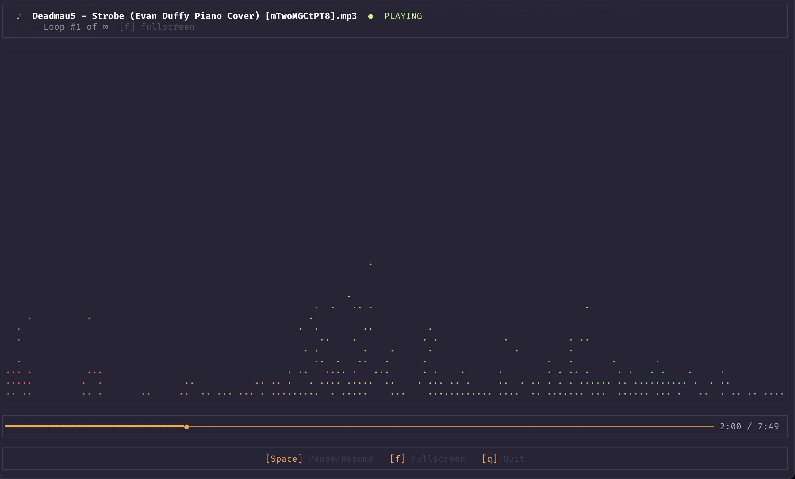

# Looper

> A CLI audio looper with a real-time FFT visualizer, startup screen, playback history, favorites, fullscreen mode, and online URL support.



## What It Does

`looper` plays audio in a terminal UI built with `ratatui`.

It supports:

- local audio files
- YouTube URLs
- SoundCloud URLs
- HypeM URLs
- single tracks and playlists
- infinite looping for single tracks
- whole-playlist looping for playlists
- pause / resume
- fullscreen visualizer
- centered ASCII startup/loading screen with cheeky boot logs
- SQLite-backed playback history and favorites
- remote download/loading UI with progress, speed, and ETA
- small source badges in the TUI for supported services (`YT`, `SC`, `HM`)
- animated terminal/tab title with playback, pause, and loading status

## Install

### Homebrew

Fresh install:

```shell
brew tap program247365/tap
brew install looper
```

Upgrade an existing install:

```shell
brew update
brew upgrade program247365/tap/looper
```

### Build from source

```shell
git clone https://github.com/program247365/looper.git
cd looper
make install
```

Requires Rust. Install via [rustup](https://rustup.rs) if needed.

### External tools for online playback

Remote URL playback depends on:

- `yt-dlp`
- `ffmpeg`

Install them with Homebrew:

```shell
brew install yt-dlp ffmpeg
```

If YouTube playback starts failing with `403` errors, update `yt-dlp` first.

## Usage

### Default startup

```shell
looper
```

This opens the playlist history browser with no active playback. Press `Enter` on a row to start playing it.

### Local file

```shell
looper play --url "/path/to/your/song.mp3"
```

### YouTube

```shell
looper play --url "https://www.youtube.com/watch?v=xAR6N9N8e6U"
```

### SoundCloud

```shell
looper play --url "https://soundcloud.com/odesza/line-of-sight-feat-wynne-mansionair"
```

### HypeM

```shell
looper play --url "https://hypem.com/track/2gq0d/CHVRCHES+-+Clearest+Blue"
```

### Playlists

```shell
looper play --url "https://www.youtube.com/playlist?list=PLFgquLnL59alCl_2TQvOiD5Vgm1hCaGSI"
```

## How Remote Playback Works

- startup opens the local SQLite database, runs embedded migrations, and then begins loading playback
- `yt-dlp` extracts track metadata and media URLs
- remote audio is cached in the OS cache directory for `looper`
- uncached remote tracks show a full-screen loading scene before playback
- single tracks loop forever
- playlists play each track once, then loop the entire playlist
- background prefetch caches upcoming playlist tracks when possible

Current behavior is intentionally pragmatic:

- YouTube uses a download-first cached path for reliability
- SoundCloud and HypeM prefer a stream-first path and fall back to cached download when needed

## Persistence

- playback history and favorites are stored in a local SQLite database
- the database lives in the OS data directory for `looper`
- startup applies pending embedded migrations automatically
- history is tracked per playable URL or canonical local file path
- each track stores title, platform, favorite state, last played timestamp, play count, and cumulative time played

## Keys

| Key | Action |
|-----|--------|
| `Space` | Pause / Resume |
| `f` | Toggle fullscreen visualizer |
| `s` | Toggle favorite for the currently playing track |
| `p` | Toggle the played-songs panel |
| `Cmd-P` | Attempt to toggle the played-songs panel when the terminal forwards the modifier |
| `q` / `Ctrl-C` | Quit |

### Played-Songs Panel

Bare `looper` opens directly into playlist history. During playback, the played-songs panel is hidden by default and opens over the minimal UI.

| Key | Action |
|-----|--------|
| `j` / `k` | Move selection down / up |
| `h` / `l` | Change sort field |
| `r` | Reverse sort direction |
| `s` | Toggle favorite for the selected row |
| `Enter` | Replay the selected track |
| `p` / `Esc` | Close the panel |

Sort fields:

- time played
- last played
- platform
- title
- times played

## Development

```shell
make run           # play fixture file (tests/fixtures/sound.mp3)
make test          # run tests
make build         # debug build
make build-release # optimized release binary
```

Useful direct commands:

```shell
cargo build
cargo build --release
cargo test
```

## Notes

- Public online URLs work best. Private, age-restricted, or members-only content may still fail depending on `yt-dlp` access.
- If a YouTube watch URL includes both `v=` and `list=`, `looper` currently normalizes it toward single-video playback unless you use the playlist URL directly.
- The remote loading UI is designed to hand off into playback cleanly rather than waiting on a full silent download.
- The startup screen and loading copy are intentionally a little cheeky.

## Releasing

```shell
make release-patch
make release-minor
```
